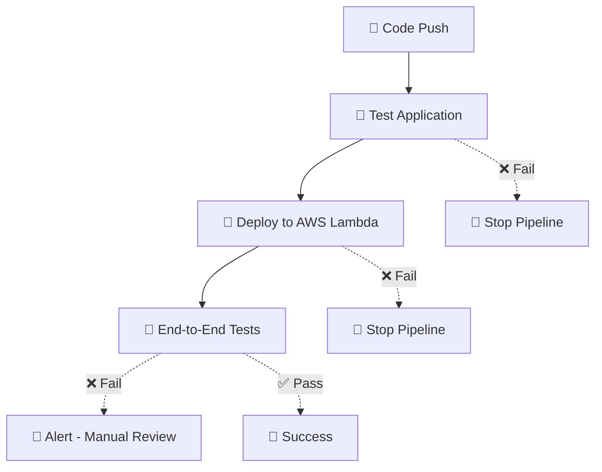

# 🎯 GitHub Actions Workflow Design

Our CI/CD pipeline follows industry best practices with a **Test → Deploy → Verify** pattern.

## 📊 Current Workflow Order



## 🎯 Why This Order is Correct

### **1. Pre-Deployment Testing (Unit Tests)**
- **Purpose**: Catch basic code issues before deployment
- **Speed**: Fast feedback (< 2 minutes)
- **Scope**: Code quality, unit tests, linting, formatting
- **If fails**: No deployment happens (fail fast)

### **2. Deployment**
- **Purpose**: Deploy validated code to cloud environment
- **Dependencies**: Only runs if tests pass (`needs: test`)
- **Scope**: Package code, update Lambda, configure infrastructure
- **If fails**: No E2E tests run

### **3. Post-Deployment Verification (E2E Tests)**
- **Purpose**: Verify deployed system works end-to-end
- **Dependencies**: Only runs if deployment succeeds (`needs: deploy`)
- **Scope**: API endpoints, integration, real environment testing
- **If fails**: Alerts for manual review/rollback

## ✅ Benefits of This Approach

- **💰 Cost Efficient**: Don't deploy broken code
- **⚡ Fast Feedback**: Catch issues early in cheaper tests
- **🛡️ Safe Deployments**: Verify actual deployed system
- **🔄 Clear Pipeline**: Each stage has specific purpose
- **📊 Good Visibility**: Know exactly where failures occur

## 🚨 What Happens When E2E Tests Fail?

Currently, if E2E tests fail:
1. **🚨 Pipeline marked as failed**
2. **📧 Developer gets notification**
3. **🔍 Manual investigation required**

### **Optional: Auto-Rollback Enhancement**

We could add an automatic rollback step:

```yaml
rollback:
  name: 🔄 Rollback on E2E Failure
  runs-on: ubuntu-latest
  needs: [deploy, e2e-tests]
  if: failure() && needs.deploy.result == 'success'

  steps:
  - name: 🔄 Rollback Lambda deployment
    run: |
      # Get previous version and rollback
      aws lambda update-function-code \
        --function-name ${{ env.LAMBDA_FUNCTION_NAME }} \
        --zip-file fileb://previous-version.zip
```

## 🎭 Alternative Patterns (Why We Don't Use Them)

### **❌ Deploy → E2E → Promote Pattern**
```
Test → Deploy to Staging → E2E → Deploy to Production
```
- **Why not**: We're using dev environment, not staging/prod split
- **When useful**: Multi-environment setups

### **❌ E2E Before Deploy Pattern**
```
Test → E2E → Deploy
```
- **Why not**: E2E tests need a deployed environment to test against
- **Impossible**: Can't test deployment without deploying

### **❌ All Tests Before Deploy Pattern**
```
Unit Tests + E2E Tests → Deploy
```
- **Why not**: E2E tests require deployed infrastructure
- **Chicken/egg**: Need deployment to test deployment

## 🔧 Current Implementation Highlights

### **Smart Wait Logic**
```bash
# Wait up to 5 minutes for API to be ready
for i in {1..30}; do
  if curl -s --max-time 10 "$API_URL/" > /dev/null 2>&1; then
    echo "✅ API is responding after ${i}0 seconds"
    break
  fi
  sleep 10
done
```

### **Layered Testing**
1. **🚀 Smoke test** - Quick validation of key endpoints
2. **🧪 Full E2E suite** - Comprehensive testing

### **Proper Dependencies**
```yaml
deploy:
  needs: test          # Deploy only if tests pass

e2e-tests:
  needs: deploy        # E2E only if deploy succeeds
  if: success()        # Explicit success check
```

## 🎉 Conclusion

**Your current workflow order is PERFECT!**

It follows industry best practices and provides:
- ✅ Fast feedback on code quality
- ✅ Safe deployments
- ✅ Real environment verification
- ✅ Clear failure points
- ✅ Cost-efficient resource usage

The **Test → Deploy → Verify** pattern is the gold standard for CI/CD pipelines.
